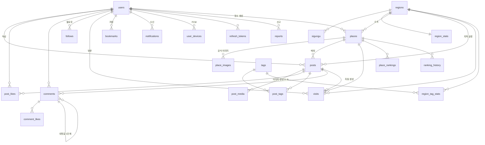

# ERD — SnapHere (27 테이블)

> 원본은 `03_schema.sql`. MySQL 8.0.46에서 실행 검증했습니다.

## 관계도

## 테이블 목록

| 그룹 | 테이블 | 역할 |
|---|---|---|
| 사용자 | `users` | 회원. `auth_type` LOCAL/GOOGLE, 인기지수·등급·SNS 링크, 탈퇴 필드 |
| | `user_devices` | FCM 토큰 (한 사용자가 여러 기기) |
| | `refresh_tokens` | 리프레시 토큰 (해시만 저장) |
| | `account_deletion_logs` | 계정 삭제 감사 로그 (개인정보 저장 안 함) |
| 소셜 | `follows` | 팔로우. PK(follower, following) + 역방향 인덱스 |
| 지역 | `regions` `sigungu` `region_stats` | 17개 시도 · 시군구 · 지역 집계 |
| 장소 | `places` | **관광지(OFFICIAL) + 사용자 장소(USER) 통합**. 공간 인덱스 |
| | `place_images` | TourAPI 공식 이미지 |
| 게시물 | `posts` | **사진과 글 통합.** 위치·Tier·인기점수·썸네일 비율 |
| | `post_media` | 이미지·영상 0~N개 |
| | `post_likes` | |
| 커뮤니티 | `comments` `comment_likes` | 댓글 (대댓글 1단계) |
| | `bookmarks` | 게시물·장소 저장 |
| 태그 | `tags` `post_tags` `region_tag_stats` | 해시태그 · 자동추천 출처 구분 · 지역별 집계 |
| 방문 | `visits` | 방문 기록 (일 1회 UNIQUE) |
| 알림 | `notifications` | 인앱 알림 + FCM 발송 이력 |
| 운영 | `reports` `sync_logs` `search_logs` | 신고 · 배치 로그 · 검색어 |
| 랭킹 | `place_rankings` `ranking_history` | 현재 스냅샷 · 변동 이력 |
| 지도 | `heatmap_cells` | 히트맵 격자 집계 |

## 설계에서 알아야 할 것

### 1. 좌표 축 순서 (MySQL 8, 실제 검증)
`POINT()` 함수는 `(경도, 위도)`, WKT 문자열은 `(위도 경도)` — **서로 반대**입니다.
`ST_X()` = 위도, `ST_Y()` = 경도. TourAPI는 `mapx`=경도, `mapy`=위도.
→ 변환은 `GeoUtils` 한 곳에서만.

### 2. 공간 인덱스
`SPATIAL INDEX` 는 NOT NULL 컬럼에만 걸립니다. 좌표 없는 데이터는 `POINT(0,0)` + `has_coordinate=0`.
쿼리에 `MBRContains` 가 없으면 풀스캔입니다.

### 3. 장소·게시물 통합
`places.place_type` 하나로 관광지와 사용자 장소를 구분합니다. 나누면 지도·피드·히트맵마다 UNION이 생깁니다.
`posts` 는 이미지 0개면 텍스트 글, 1개 이상이면 사진 게시물입니다.

### 4. 랭킹·히트맵은 스냅샷
`place_rankings` / `heatmap_cells` 는 배치가 UPSERT하는 결과 테이블입니다.
`area_code = 0` 은 전국을 뜻합니다 (NULL을 쓰면 UNIQUE 제약이 동작하지 않습니다).
`theme` 컬럼이 있어 테마별·숨은명소 랭킹이 스키마 변경 없이 확장됩니다.

### 5. 비정규화 카운터
`like_count` `post_count` `follower_count` 등은 조회 성능용 중복 컬럼입니다.
**매일 새벽 실제 COUNT로 덮어쓰는 보정 배치가 필요합니다.**

### 6. 논리 삭제
전부 `status` 컬럼으로 처리합니다. 물리 삭제는 배치로만.
목록 쿼리에서 `status='ACTIVE'` 조건이 빠지면 삭제된 데이터가 노출됩니다.
